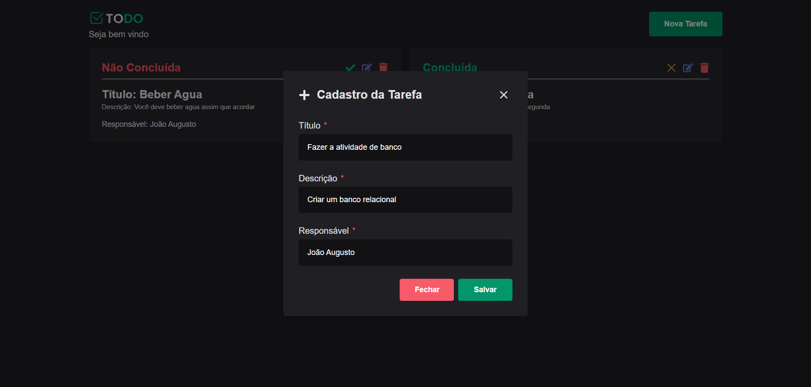
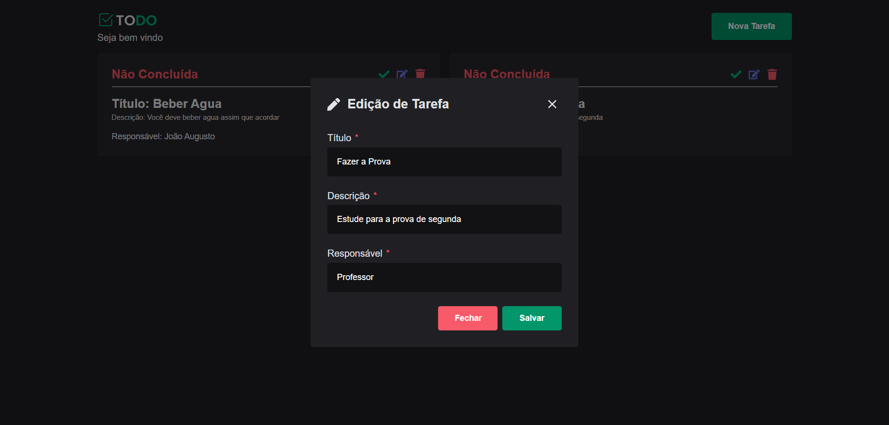
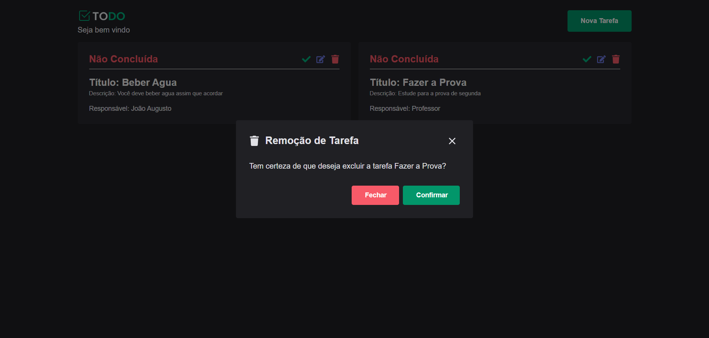
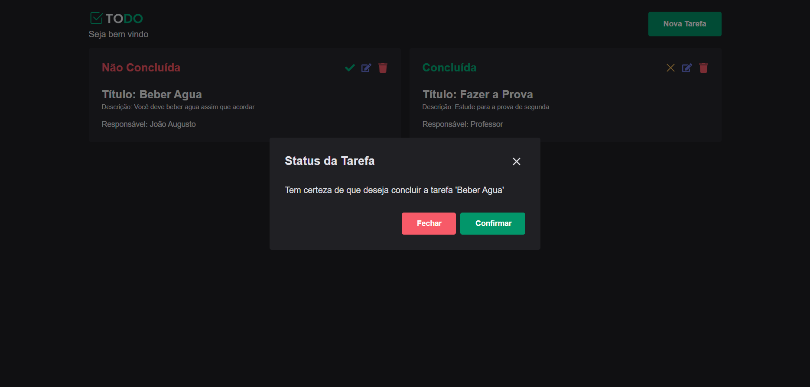
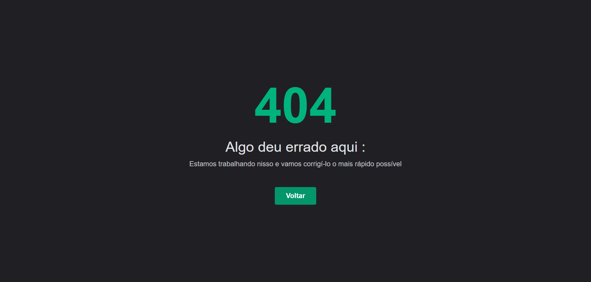
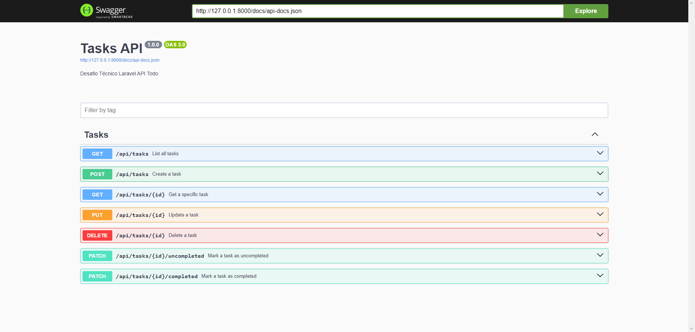
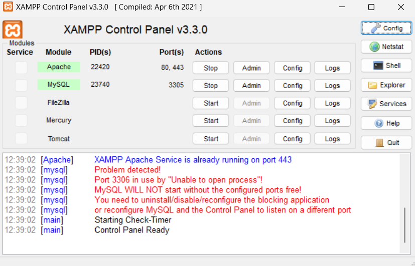
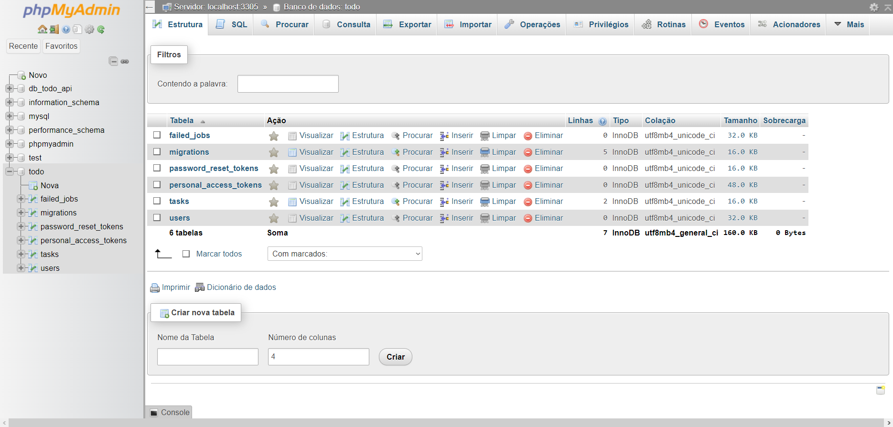

## Front End

https://github.com/augustodevjs/desafio-7cantos/assets/90275457/c3098031-a4bc-48f8-b757-c604bc774185
<h1></h1>
<h1></h1>
<h1></h1>
<h1></h1>
<h1></h1>
<h1></h1>
<hr>
<br>

## Back End

https://github.com/augustodevjs/desafio-7cantos/assets/90275457/0405cfa9-8fdf-4521-bb80-6a4ac4038dc2
<h1></h1>
<h1></h1>
<h1></h1>

## Explicações

Projeto full-stack desenvolvido com React no FrontEnd, usando NxWorkspace como ferramenta para criar projetos front-ends escaláveis. A estrutura do projeto segue os princípios da arquitetura limpa, dividindo-o em camadas bem definidas, incluindo: Service, Domain-types, Modules, Core, environment e components.

No FrontEnd, realizei todas as validações de erros provenientes da API, incorporando classes especializadas para o tratamento desses erros. Isso garante uma experiência de usuário suave e tratamento adequado de problemas que possam surgir durante a interação com a aplicação.

No BackEnd, utilizei PHP com Laravel para implementar as operações CRUD relacionadas ao desafio. Além disso, incluí todas as propriedades das models mencionadas no documento do desafio. Para facilitar o entendimento e integração com o FrontEnd, também disponibilizei uma documentação Swagger completa, que permite visualizar e compreender como a API funciona.

## Como rodar o projeto

```bash
# Faça o clone do projeto
$ git clone https://github.com/augustodevjs/desafio-7cantos

# Configuração do Backend
  1 - entre no diretório -- cd ./backend
  2 - baixe o xamp - https://www.apachefriends.org
  3 - baixe o composer - https://getcomposer.org
  4 - rode o apache e o mysql na porta 3305 para não ocorrer um erro por conta do .env
  5 - crie uma database chamada todo
  6 - crie um arquivo .env e copie os dados do .env.example
  7 - rode as migrations -- php artisan migrate
  8 - rode o projeto -- php artisan serve
  9 - entra nessa url para visualizar a documentação do swagger -- http://127.0.0.1:8000/api/documentation

# Configuração do Front End
  1 - entre no diretório -- cd ./frontend
  2 - instale as dependências do projeto -- yarn install
  3 - crie um arquivo .env e copie os dados do .env.example para esse arquivo
  4 - caso queira vê as dependências de cada lib feito pelo nx worskpace rode -- npx nx graph
  5 - rode o projeto -- yarn start
```
